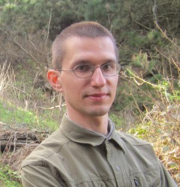

# About

I am an independent software developer working on mobile applications for Android and iOS.

I obtained my PhD in mathematics from the University of Pittsburgh. 
My advisor was [Prof. Thomas Hales](https://sites.google.com/site/thalespitt/).
Then I was a postdoctoral researcher in the School of Computing at the University of Utah in Prof. Ganesh Gopalakrishnan's [Gauss Group](http://formalverification.cs.utah.edu/new/).

# Resume

[Curriculum Vitae](assets/CV.pdf)

# My profiles elsewhere

[Github](https://github.com/monadius)

[LinkedIn](https://www.linkedin.com/pub/alexey-solovyev/63/9/525)

[Codewars](https://www.codewars.com/users/monadius/)
